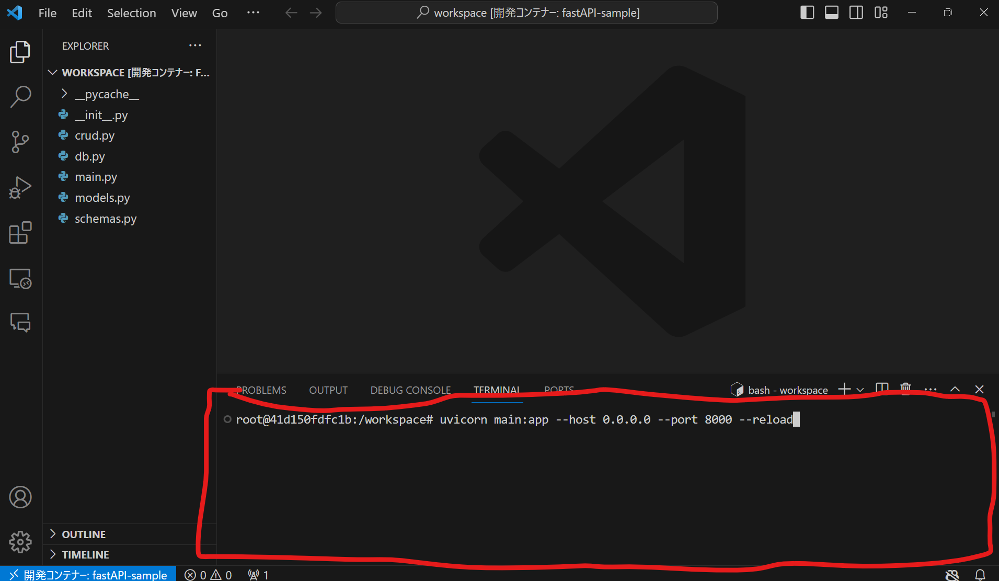
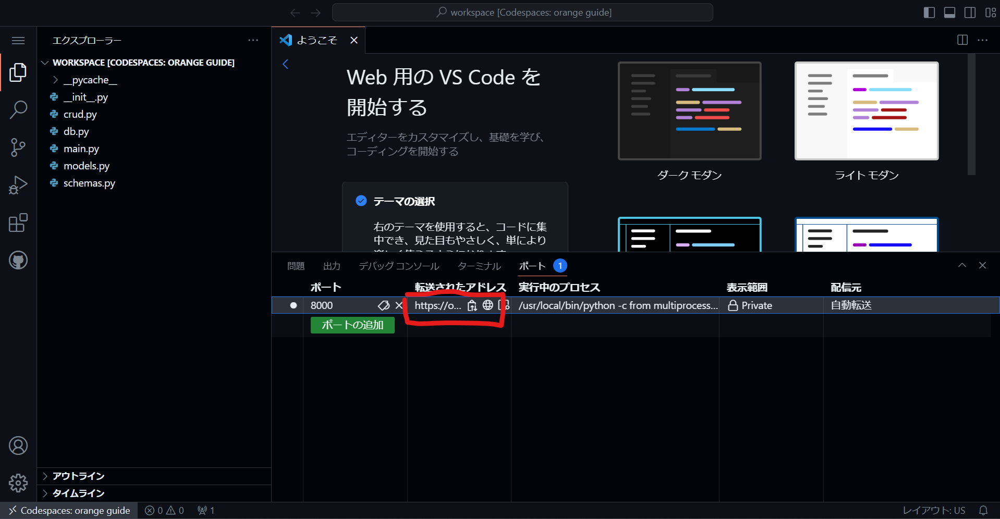
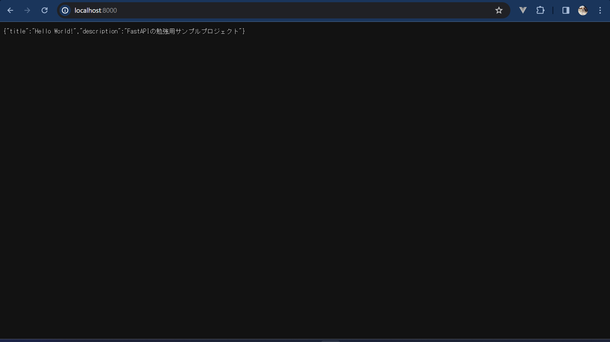

# fastAPI 勉強用サンプル

FastAPI 勉強用のサンプルプロジェクトです。

## 使い方

codespace を使う人
github から create codespace をおしてください

visual studio code を使う人
Dev Containers（拡張機能）入れた後に画面左下の矢印が向かい合っているマークを押し、コンテナで再度開くを押してください。

ターミナルに  
uvicorn main:app --host 0.0.0.0 --port 8000 --reload  
とうってください

chrome などで URL に localhost:8000 と入力してください(codespace を用いていない人)  
codespace を使っている人は下の画像の赤線で囲んだ URL を ctr キーを押しながらクリックしてください。 

次のような画面が出てきたら成功です！  

以下の URL で各種機能を見れます(codespace を用いていない人)  
自作 API のドキュメント: localhost:8000/docs  
PhpMyAdmin: localhost:80  
